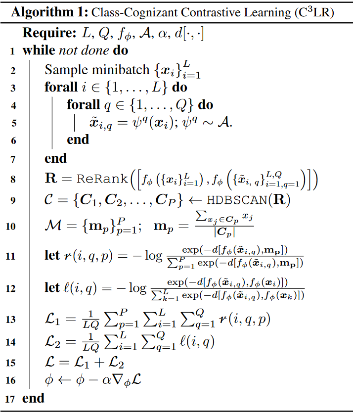

 <!-- TODO: Superscript C3LR -->
# This Repo holds the code for C<sup>3</sup>LR

This is the official repository for [Self-Supervised Class-Cognizant Few-Shot Classification](https://arxiv.org/abs/2202.08149) (Ojas Kishore Shirekar, Hadi Jamali-Rad).

# Introduction
Unsupervised learning is argued to be the dark matter of human intelligence. To build in this direction, this paper focuses on unsupervised learning from an abundance of unlabeled data followed by few-shot fine-tuning on a downstream classification task. To this aim, we extend a recent study on adopting contrastive learning for unsupervised pre-training by incorporating class-level cognizance and expanding the contrastive optimization loss to account for it. Our experimentation both in standard and cross-domain scenarios demonstrate that we not only stay current with the state-of-the-art (SoTA) in all scenarios but also sets a new SoTA in (5-way, 1 and 5-shot) settings for mini-ImageNet dataset.

The high-level idea here is to not only enforce the latent embeddings of augmented images come close to that of the source image in the embedding space (the classical contrastive setting), but also enforce embeddings of the images belonging to each cluster (and their augmentations) come closer to each other, for which a preceding unsupervised cluster formation step is required. This can help enforce similar classes into separate clusters, which will in turn be used as additional information in a modified two-term contrastive loss.

# Algorithm
Algorithm Flow             |  Algorithm
:-------------------------:|:-------------------------:
  |  

The algorithm consists of the following major high-level components:

1. Batch generation (including augmentation)
2. Re-ranking and Clustering
3. Class-cognizant contrastive loss
4. Standard contrastive loss


# Results on Omniglot and mini-ImageNet

| Method(N,K)                    | (5,1)        | (5,5)        | (5,1)         | (5,5)        |
|--------------------------------|--------------|--------------|---------------|--------------|
| CACTUs-MAML [3]                   | 68.84 ± 0.80 | 87.78 ± 0.50 | 39.90 	± 0.74 | 53.97 ± 0.70 |
| CACTUs-ProtoNet [3]                | 68.12 ± 0.84 | 83.58 ± 0.61 | 39.18 ± 0.71  | 53.36 ± 0.70 |
| UMTRA [4]                         | 83.80        | 95.43        | 39.93         | 50.73        |
| AAL-ProtoNet [8]                  | 84.66 ± 0.70 | 89.14 ± 0.27 | 37.67 ± 0.39  | 40.29 ± 0.68 |
| AAL-MAML++ [8]                    | 88.40 ± 0.75 | 97.96 ± 0.32 | 34.57 ± 0.74  | 49.18± 0.47  |
| UFLST [2]                         | 97.03        | 99.19        | 33.77 ± 0.70  | 45.03 ± 0.73 |
| ULDA-ProtoNet [9]                 | -            | -            | 40.63 ± 0.61  | 55.41 ± 0.57 |
| ULDA-MetaOptNet [9]               | -            | -            | 40.71 ± 0.62  | 54.49 ± 0.58 |
| U-SoSN+ ArL [10]                   | -            | -            | 41.13 ± 0.84  | 55.39 ± 0.79 |
| LASIUM [7]                        | 83.26 ± 0.55 | 95.29 ± 0.22 | 40.19 ± 0.58  | 54.56 ± 0.55 |
| ProtoTransfer (L=50) [1]           | 88.00 ± 0.64 | 96.48 ± 0.26 | 45.67 ± 0.79  | 62.99 ± 0.75 |
| ProtoTransfer (L=200)          | 88.37 ± 0.74 | 96.54 ± 0.41 | 44.17 ± 1.08  | 61.07 ± 0.82 |
| **C<sup>3</sup>LR** (**ours**) | 89.30 ± 0.64 | 97.38 ± 0.23 | 47.92 ± 1.2   | 64.81 ± 1.15 |
| MAML  (supervised) [1]             | 94.46 ± 0.35 | 98.83 ± 0.12 | 46.81 ± 0.77  | 62.13 ± 0.72 |
| ProtoNet  (supervised) [1]         | 97.70 ± 0.29 | 99.28 ± 0.10 | 46.44 ± 0.78  | 66.33 ± 0.68 |
| MMC   (supervised) [11]            | 97.68 ± 0.07 | -            | 50.41 ± 0.31  | 64.39 ± 0.24 |
| FEAT  (supervised)  [12]           | -            | -            | 55.15         | 71.61        |
| Pre+Linear   (supervised) [5]     | 94.30 ± 0.43 | 99.08 ± 0.10 | 43.87 ± 0.69  | 63.01 ± 0.71 |


# Requirements

1. `cd` into the `c3lr` folder
2. Create a new conda environment by running: `conda env create -f environment.yml`
3. Activate the environment by running `conda activate c3lr`

# Running Experiments

1. **Make sure all required packages are installed before running the experiments**
2. Ensure that there is enough space for datasets to be downloaded - incase they haven't been downloaded already
3. The folder `run_scripts -> local` contains bash scripts to help run the code


# Citation

```(bibtex)
@article{shirekar2022self,
  title={Self-Supervised Class-Cognizant Few-Shot Classification},
  author={Shirekar, Ojas Kishore and Jamali-Rad, Hadi},
  journal={arXiv preprint arXiv:2202.08149},
  year={2022}
}
```

# Contact

Corresponding author: Ojas Kishore Shirekar (<o.k.shirekar@student.tudelft.nl>)

# References

1. Medina, Carlos, Arnout Devos, and Matthias Grossglauser. "Self-supervised prototypical transfer learning for few-shot classification." arXiv preprint arXiv:2006.11325 (2020).

2. Zilong Ji, Xiaolong Zou, Tiejun Huang, and Si Wu. Unsupervised few-shot learning via self-supervised training. arXiv preprint arXiv:1912.12178, 2019.

3. Kyle Hsu, Sergey Levine, and Chelsea Finn. Unsupervised learning via meta-learning. arXiv preprint arXiv:1810.02334, 2018.

4. Siavash Khodadadeh, Ladislau Boloni, and Mubarak Shah. Unsupervised meta-learning for few-shot image classification. Advances in neural information processing systems, 32, 2019.

5. Guneet S Dhillon, Pratik Chaudhari, Avinash Ravichandran, and Stefano Soatto. A baseline for few-shot image classification. arXiv preprint arXiv:1909.02729, 2019.

6. Jake Snell, Kevin Swersky, and Richard Zemel. Prototypical networks for few-shot learning. Advances in neural information processing systems, 30, 2017.

7. Siavash Khodadadeh, Sharare Zehtabian, Saeed Vahidian, Weijia Wang, Bill Lin, and Ladislau Bölöni. Unsupervised meta-learning through latent-space interpolation in generative models. arXiv preprint arXiv:2006.10236, 2020.

8. Antreas Antoniou and Amos Storkey. Assume, augment and learn: Unsupervised few-shot meta-learning via random labels and data augmentation. arXiv preprint arXiv:1902.09884, 2019.

9. Tiexin Qin, Wenbin Li, Yinghuan Shi, and Yang Gao. Diversity helps: Unsupervised few-shot learning via distribution shift-based data augmentation. arXiv preprint arXiv:2004.05805, 2020.

10. Hongguang Zhang, Piotr Koniusz, Songlei Jian, Hongdong Li, and Philip HS Torr. Rethinking class relations: Absolute-relative supervised and unsupervised few-shot learning. In Proceedings of the IEEE/CVF Conference on Computer Vision and Pattern Recognition, pages 9432–9441, 2021.

11. Mengye Ren, Eleni Triantafillou, Sachin Ravi, Jake Snell, Kevin Swersky, Joshua B Tenenbaum, Hugo Larochelle, and Richard S Zemel. Meta-learning for semi-supervised few-shot classification. arXiv preprint arXiv:1803.00676, 2018.

12. Han-Jia Ye, Hexiang Hu, De-Chuan Zhan, and Fei Sha. Few-shot learning via embedding adaptation with set-to-set functions. In Proceedings of the IEEE/CVF Conference on Computer Vision and Pattern Recognition, pages 8808–8817, 2020.